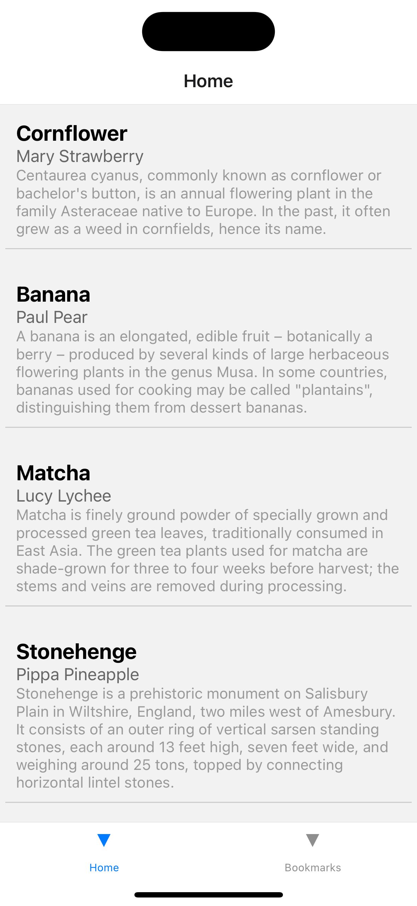
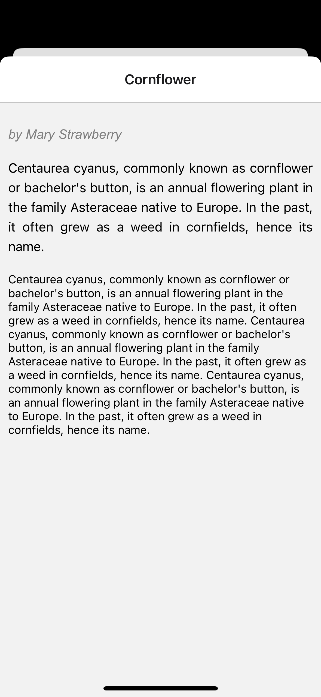

# News app 



## Developer setup
```sh
cd 'path/of/project'
npm install
```
### Graphql schemas and types

Setup your graphql schema in both files codegen.schema.yml and codegen.types.yml 

```sh
npm run generate:gql:schema
npm run generate:gql:types 
```

### For Ios build
```sh
npm run ios 
or 
yarn ios
```

### For Android build
```sh
npm run android 
or 
yarn android
```

